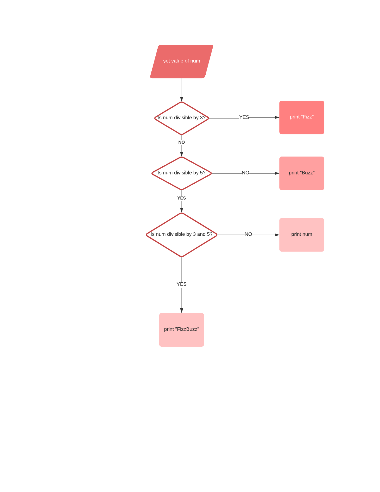

# fizzbuzz-simple-logic-game

## Description

A simple logic game in python created by following a tutorial

## Iterations of Logic Flow Chart

- logic flow chart 1 

- The logic in the chart above never gets to check if a number is divisible by both 3 and 5, as it exits at "Is num divisible by 3" in that case.

- logic flow chart 2 

## References

- [tinypng](https://tinypng.com/)

- [lucid chart](https://www.lucidchart.com)

### Stack Exchange

- [How do you check whether a number is divisible by another number (Python)?](https://stackoverflow.com/questions/8002217/how-do-you-check-whether-a-number-is-divisible-by-another-number-python)